# [📈 Live Status](https://Skiddle-ID.github.io/status): <!--live status--> **🟩 All systems operational**

This repository contains the open-source uptime monitor and status page for [Skiddle ID](https://skiddle.id), powered by [Upptime](https://github.com/upptime/upptime).

With [Upptime](https://upptime.js.org), you can get your own unlimited and free uptime monitor and status page, powered entirely by a GitHub repository. We use [Issues](https://github.com/Skiddle-ID/status/issues) as incident reports, [Actions](https://github.com/Skiddle-ID/status/actions) as uptime monitors, and [Pages](https://Skiddle-ID.github.io/status) for the status page.

<!--start: status pages-->
<!-- This summary is generated by Upptime (https://github.com/upptime/upptime) -->
<!-- Do not edit this manually, your changes will be overwritten -->
<!-- prettier-ignore -->
| URL | Status | History | Response Time | Uptime |
| --- | ------ | ------- | ------------- | ------ |
|  [Polaris (Internal Main Cluster)](https://api.skiddle.cloud/internal/polaris/health) | 🟩 Up | [polaris-internal-main-cluster.yml](https://github.com/Skiddle-ID/status/commits/HEAD/history/polaris-internal-main-cluster.yml) | 

 108ms
     
 | 

<a href="https://Skiddle-ID.github.io/status/history/polaris-internal-main-cluster">100.00%</a>
    

|  [Orion (Auth Service)](https://api.skiddle.cloud/internal/orion/health) | 🟩 Up | [orion-auth-service.yml](https://github.com/Skiddle-ID/status/commits/HEAD/history/orion-auth-service.yml) | 

 14ms
     
 | 

<a href="https://Skiddle-ID.github.io/status/history/orion-auth-service">100.00%</a>
    

|  [Andromeda (Storage Service)](https://api.skiddle.cloud/internal/andromeda/health) | 🟩 Up | [andromeda-storage-service.yml](https://github.com/Skiddle-ID/status/commits/HEAD/history/andromeda-storage-service.yml) | 

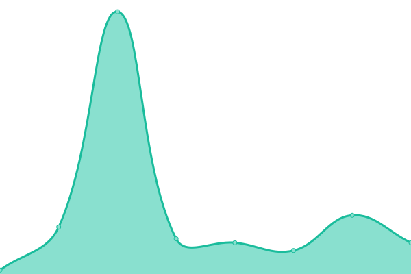 16ms
     
 | 

<a href="https://Skiddle-ID.github.io/status/history/andromeda-storage-service">100.00%</a>
    

|  [Mewtwo (Primary NAS)](https://api.skiddle.cloud/internal/mewtwo/health) | 🟩 Up | [mewtwo-primary-nas.yml](https://github.com/Skiddle-ID/status/commits/HEAD/history/mewtwo-primary-nas.yml) | 

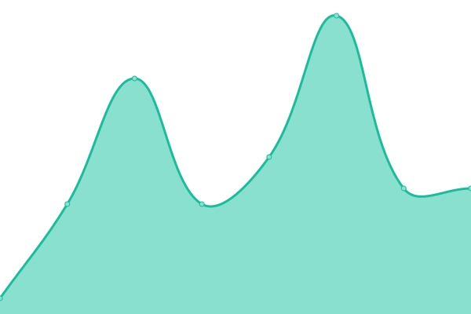 15ms
     
 | 

<a href="https://Skiddle-ID.github.io/status/history/mewtwo-primary-nas">100.00%</a>
    

|  [Torchic (Home NAS)](https://api.skiddle.cloud/internal/torchic/health) | 🟩 Up | [torchic-home-nas.yml](https://github.com/Skiddle-ID/status/commits/HEAD/history/torchic-home-nas.yml) | 

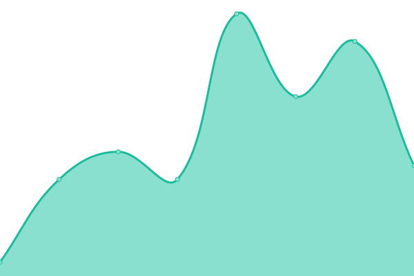 15ms
     
 | 

<a href="https://Skiddle-ID.github.io/status/history/torchic-home-nas">100.00%</a>
    

|  [Cassiopeia (Monitoring Service)](https://api.skiddle.cloud/internal/cassiopeia/health) | 🟩 Up | [cassiopeia-monitoring-service.yml](https://github.com/Skiddle-ID/status/commits/HEAD/history/cassiopeia-monitoring-service.yml) | 

 14ms
     
 | 

<a href="https://Skiddle-ID.github.io/status/history/cassiopeia-monitoring-service">100.00%</a>
    

|  [Cygnus (Firewall /w PFsense)](https://api.skiddle.cloud/network/cygnus/health) | 🟩 Up | [cygnus-firewall-w-p-fsense.yml](https://github.com/Skiddle-ID/status/commits/HEAD/history/cygnus-firewall-w-p-fsense.yml) | 

 14ms
     
 | 

<a href="https://Skiddle-ID.github.io/status/history/cygnus-firewall-w-p-fsense">100.00%</a>
    

|  [Phoenix (Internal proxy)](https://api.skiddle.cloud/network/phoenix/health) | 🟩 Up | [phoenix-internal-proxy.yml](https://github.com/Skiddle-ID/status/commits/HEAD/history/phoenix-internal-proxy.yml) | 

 14ms
     
 | 

<a href="https://Skiddle-ID.github.io/status/history/phoenix-internal-proxy">100.00%</a>
    

|  [Eevee (8 Nodes Raspberry Pi Cluster)](https://api.skiddle.cloud/internal/eevee/health) | 🟩 Up | [eevee-8-nodes-raspberry-pi-cluster.yml](https://github.com/Skiddle-ID/status/commits/HEAD/history/eevee-8-nodes-raspberry-pi-cluster.yml) | 

 14ms
     
 | 

<a href="https://Skiddle-ID.github.io/status/history/eevee-8-nodes-raspberry-pi-cluster">100.00%</a>
    

|  [Hydra (Computing Cluster)](https://api.skiddle.cloud/internal/hydra/health) | 🟩 Up | [hydra-computing-cluster.yml](https://github.com/Skiddle-ID/status/commits/HEAD/history/hydra-computing-cluster.yml) | 

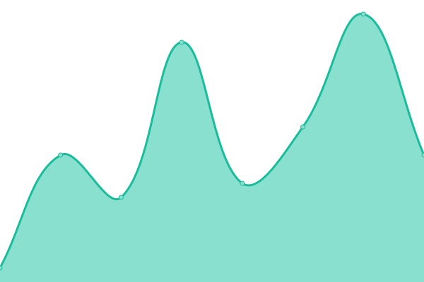 13ms
     
 | 

<a href="https://Skiddle-ID.github.io/status/history/hydra-computing-cluster">100.00%</a>
    

|  [Pegasus (Computing Cluster)](https://api.skiddle.cloud/internal/pegasus/health) | 🟩 Up | [pegasus-computing-cluster.yml](https://github.com/Skiddle-ID/status/commits/HEAD/history/pegasus-computing-cluster.yml) | 

 14ms
     
 | 

<a href="https://Skiddle-ID.github.io/status/history/pegasus-computing-cluster">100.00%</a>
    

|  [Discovery (Monitoring API)](https://api.skiddle.cloud/external/discovery/health) | 🟩 Up | [discovery-monitoring-api.yml](https://github.com/Skiddle-ID/status/commits/HEAD/history/discovery-monitoring-api.yml) | 

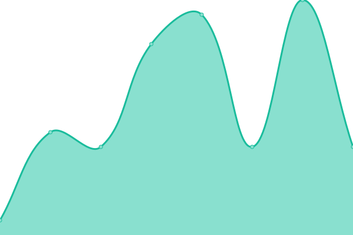 14ms
     
 | 

<a href="https://Skiddle-ID.github.io/status/history/discovery-monitoring-api">100.00%</a>
    

|  [Apollo-1 (Apollo Cluster)](https://api.skiddle.cloud/external/apollo-1/health) | 🟩 Up | [apollo-1-apollo-cluster.yml](https://github.com/Skiddle-ID/status/commits/HEAD/history/apollo-1-apollo-cluster.yml) | 

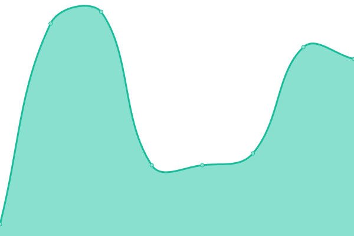 13ms
     
 | 

<a href="https://Skiddle-ID.github.io/status/history/apollo-1-apollo-cluster">100.00%</a>
    

|  [Apollo-2 (Apollo Cluster)](https://api.skiddle.cloud/external/apollo-2/health) | 🟩 Up | [apollo-2-apollo-cluster.yml](https://github.com/Skiddle-ID/status/commits/HEAD/history/apollo-2-apollo-cluster.yml) | 

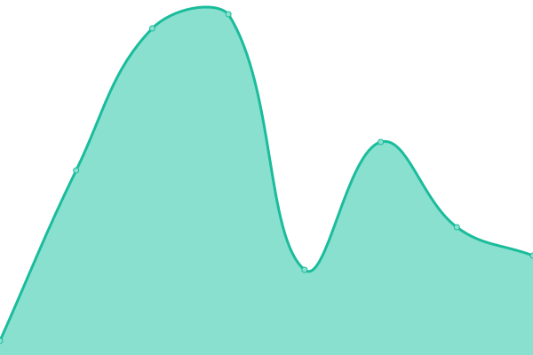 16ms
     
 | 

<a href="https://Skiddle-ID.github.io/status/history/apollo-2-apollo-cluster">100.00%</a>
    

|  [Voyager-1 (Voyager Cluster)](https://api.skiddle.cloud/external/voyager-1/health) | 🟩 Up | [voyager-1-voyager-cluster.yml](https://github.com/Skiddle-ID/status/commits/HEAD/history/voyager-1-voyager-cluster.yml) | 

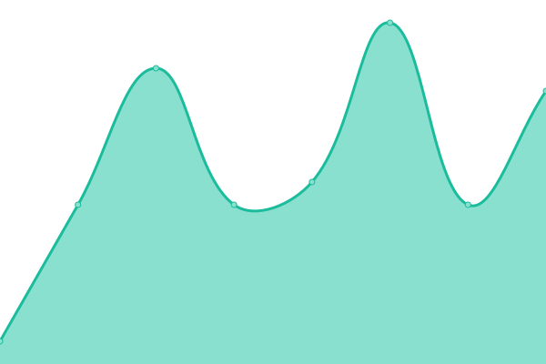 13ms
     
 | 

<a href="https://Skiddle-ID.github.io/status/history/voyager-1-voyager-cluster">100.00%</a>
    

|  [Voyager-2 (Voyager Cluster)](https://api.skiddle.cloud/external/voyager-2/health) | 🟩 Up | [voyager-2-voyager-cluster.yml](https://github.com/Skiddle-ID/status/commits/HEAD/history/voyager-2-voyager-cluster.yml) | 

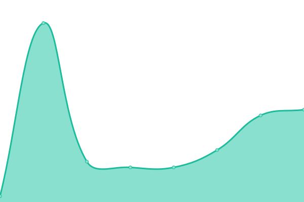 14ms
     
 | 

<a href="https://Skiddle-ID.github.io/status/history/voyager-2-voyager-cluster">100.00%</a>
    

|  [Odyssey-1 (Odyssey Cluster)](https://api.skiddle.cloud/external/odyssey-1/health) | 🟩 Up | [odyssey-1-odyssey-cluster.yml](https://github.com/Skiddle-ID/status/commits/HEAD/history/odyssey-1-odyssey-cluster.yml) | 

 12ms
     
 | 

<a href="https://Skiddle-ID.github.io/status/history/odyssey-1-odyssey-cluster">100.00%</a>
    

|  [Odyssey-2 (Odyssey Cluster)](https://api.skiddle.cloud/external/odyssey-2/health) | 🟩 Up | [odyssey-2-odyssey-cluster.yml](https://github.com/Skiddle-ID/status/commits/HEAD/history/odyssey-2-odyssey-cluster.yml) | 

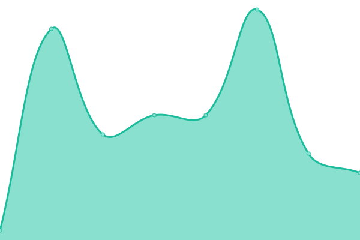 14ms
     
 | 

<a href="https://Skiddle-ID.github.io/status/history/odyssey-2-odyssey-cluster">100.00%</a>
    

|  [Odyssey-3 (Odyssey Cluster)](https://api.skiddle.cloud/external/odyssey-3/health) | 🟩 Up | [odyssey-3-odyssey-cluster.yml](https://github.com/Skiddle-ID/status/commits/HEAD/history/odyssey-3-odyssey-cluster.yml) | 

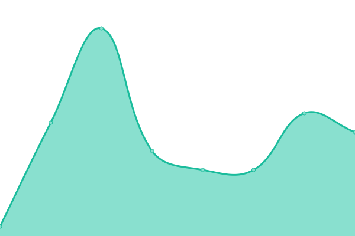 14ms
     
 | 

<a href="https://Skiddle-ID.github.io/status/history/odyssey-3-odyssey-cluster">100.00%</a>
    

|  [Gemini (Media Server /w Plex)](https://api.skiddle.cloud/external/gemini/health) | 🟩 Up | [gemini-media-server-w-plex.yml](https://github.com/Skiddle-ID/status/commits/HEAD/history/gemini-media-server-w-plex.yml) | 

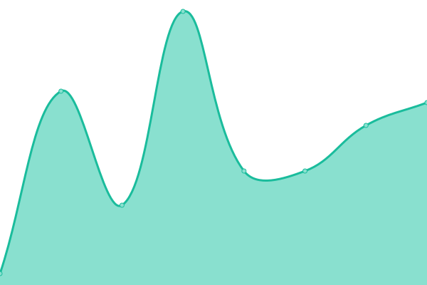 14ms
     
 | 

<a href="https://Skiddle-ID.github.io/status/history/gemini-media-server-w-plex">100.00%</a>
    

|  [Pioneer (Experimenting Nodes)](https://api.skiddle.cloud/external/pioneer/health) | 🟩 Up | [pioneer-experimenting-nodes.yml](https://github.com/Skiddle-ID/status/commits/HEAD/history/pioneer-experimenting-nodes.yml) | 

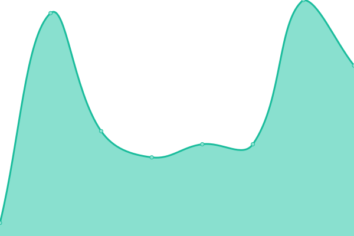 14ms
     
 | 

<a href="https://Skiddle-ID.github.io/status/history/pioneer-experimenting-nodes">100.00%</a>
    

|  [Endeavour (Experimenting Nodes)](https://api.skiddle.cloud/external/endeavour/health) | 🟩 Up | [endeavour-experimenting-nodes.yml](https://github.com/Skiddle-ID/status/commits/HEAD/history/endeavour-experimenting-nodes.yml) | 

 14ms
     
 | 

<a href="https://Skiddle-ID.github.io/status/history/endeavour-experimenting-nodes">100.00%</a>
    

|  [Atlantis (Experimenting Nodes)](https://api.skiddle.cloud/external/atlantis/health) | 🟩 Up | [atlantis-experimenting-nodes.yml](https://github.com/Skiddle-ID/status/commits/HEAD/history/atlantis-experimenting-nodes.yml) | 

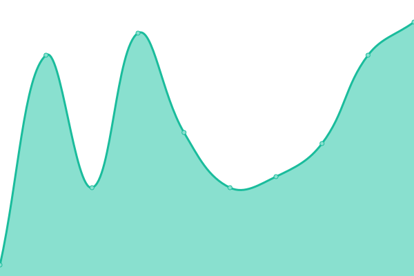 14ms
     
 | 

<a href="https://Skiddle-ID.github.io/status/history/atlantis-experimenting-nodes">100.00%</a>
    

|  [Europa (Cloud Main Server)](https://api.skiddle.cloud/cloud/europa/health) | 🟩 Up | [europa-cloud-main-server.yml](https://github.com/Skiddle-ID/status/commits/HEAD/history/europa-cloud-main-server.yml) | 

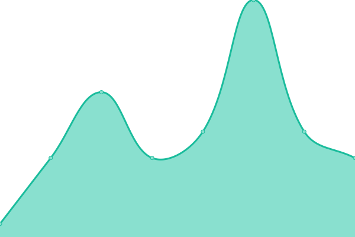 14ms
     
 | 

<a href="https://Skiddle-ID.github.io/status/history/europa-cloud-main-server">100.00%</a>
    

|  [Europa-2 (Europa Workers)](https://api.skiddle.cloud/cloud/europa-2/health) | 🟩 Up | [europa-2-europa-workers.yml](https://github.com/Skiddle-ID/status/commits/HEAD/history/europa-2-europa-workers.yml) | 

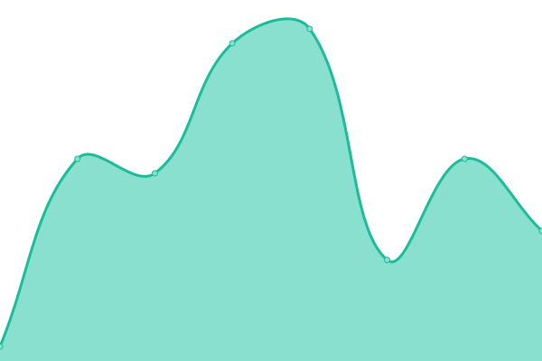 14ms
     
 | 

<a href="https://Skiddle-ID.github.io/status/history/europa-2-europa-workers">100.00%</a>
    

|  [Europa-3 (Europa Workers)](https://api.skiddle.cloud/cloud/europa-3/health) | 🟩 Up | [europa-3-europa-workers.yml](https://github.com/Skiddle-ID/status/commits/HEAD/history/europa-3-europa-workers.yml) | 

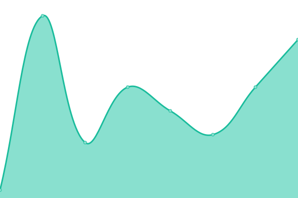 14ms
     
 | 

<a href="https://Skiddle-ID.github.io/status/history/europa-3-europa-workers">100.00%</a>
    

|  [Helios-1 (Helios Cluster Controller)](https://api.skiddle.cloud/cloud/helios-1/health) | 🟩 Up | [helios-1-helios-cluster-controller.yml](https://github.com/Skiddle-ID/status/commits/HEAD/history/helios-1-helios-cluster-controller.yml) | 

 14ms
     
 | 

<a href="https://Skiddle-ID.github.io/status/history/helios-1-helios-cluster-controller">100.00%</a>
    

|  [Helios-2](https://api.skiddle.cloud/cloud/helios-2/health) | 🟩 Up | [helios-2.yml](https://github.com/Skiddle-ID/status/commits/HEAD/history/helios-2.yml) | 

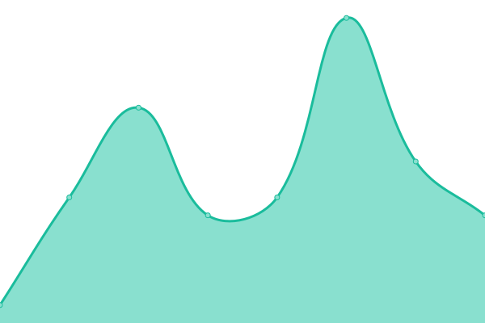 14ms
     
 | 

<a href="https://Skiddle-ID.github.io/status/history/helios-2">100.00%</a>
    

|  [Helios-3](https://api.skiddle.cloud/cloud/helios-3/health) | 🟩 Up | [helios-3.yml](https://github.com/Skiddle-ID/status/commits/HEAD/history/helios-3.yml) | 

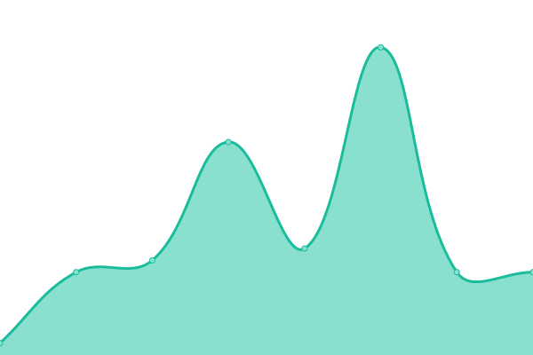 14ms
     
 | 

<a href="https://Skiddle-ID.github.io/status/history/helios-3">100.00%</a>
    

|  [Helios-4](https://api.skiddle.cloud/cloud/helios-4/health) | 🟩 Up | [helios-4.yml](https://github.com/Skiddle-ID/status/commits/HEAD/history/helios-4.yml) | 

 13ms
     
 | 

<a href="https://Skiddle-ID.github.io/status/history/helios-4">100.00%</a>
    

|  [Helios-5](https://api.skiddle.cloud/cloud/helios-5/health) | 🟩 Up | [helios-5.yml](https://github.com/Skiddle-ID/status/commits/HEAD/history/helios-5.yml) | 

 16ms
     
 | 

<a href="https://Skiddle-ID.github.io/status/history/helios-5">100.00%</a>
    

|  [Helios-6](https://api.skiddle.cloud/cloud/helios-6/health) | 🟩 Up | [helios-6.yml](https://github.com/Skiddle-ID/status/commits/HEAD/history/helios-6.yml) | 

 14ms
     
 | 

<a href="https://Skiddle-ID.github.io/status/history/helios-6">100.00%</a>
    

|  [Helios-7](https://api.skiddle.cloud/cloud/helios-7/health) | 🟩 Up | [helios-7.yml](https://github.com/Skiddle-ID/status/commits/HEAD/history/helios-7.yml) | 

 14ms
     
 | 

<a href="https://Skiddle-ID.github.io/status/history/helios-7">100.00%</a>
    

|  [Helios-8](https://api.skiddle.cloud/cloud/helios-8/health) | 🟩 Up | [helios-8.yml](https://github.com/Skiddle-ID/status/commits/HEAD/history/helios-8.yml) | 

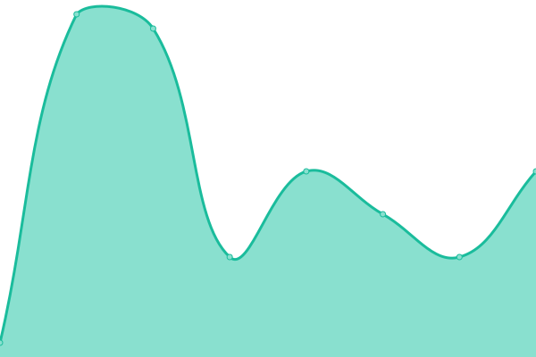 14ms
     
 | 

<a href="https://Skiddle-ID.github.io/status/history/helios-8">100.00%</a>
    

|  [Helios-9](https://api.skiddle.cloud/cloud/helios-9/health) | 🟩 Up | [helios-9.yml](https://github.com/Skiddle-ID/status/commits/HEAD/history/helios-9.yml) | 

 13ms
     
 | 

<a href="https://Skiddle-ID.github.io/status/history/helios-9">100.00%</a>
    

|  [Asteria-1 (Asteria Cluster Controller)](https://api.skiddle.cloud/cloud/asteria-1/health) | 🟩 Up | [asteria-1-asteria-cluster-controller.yml](https://github.com/Skiddle-ID/status/commits/HEAD/history/asteria-1-asteria-cluster-controller.yml) | 

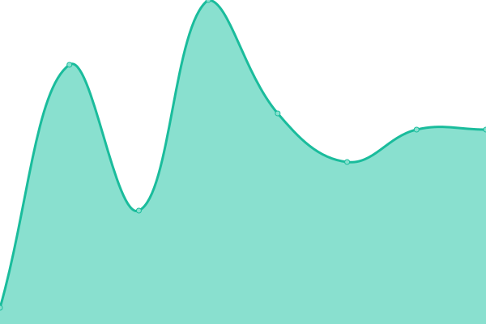 14ms
     
 | 

<a href="https://Skiddle-ID.github.io/status/history/asteria-1-asteria-cluster-controller">100.00%</a>
    

|  [Asteria-2](https://api.skiddle.cloud/cloud/asteria-2/health) | 🟩 Up | [asteria-2.yml](https://github.com/Skiddle-ID/status/commits/HEAD/history/asteria-2.yml) | 

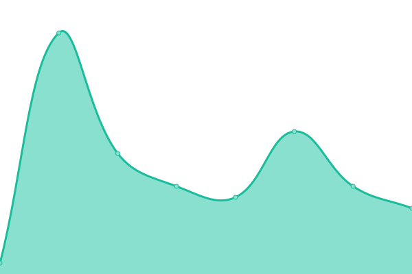 14ms
     
 | 

<a href="https://Skiddle-ID.github.io/status/history/asteria-2">100.00%</a>
    

|  [Asteria-3](https://api.skiddle.cloud/cloud/asteria-3/health) | 🟩 Up | [asteria-3.yml](https://github.com/Skiddle-ID/status/commits/HEAD/history/asteria-3.yml) | 

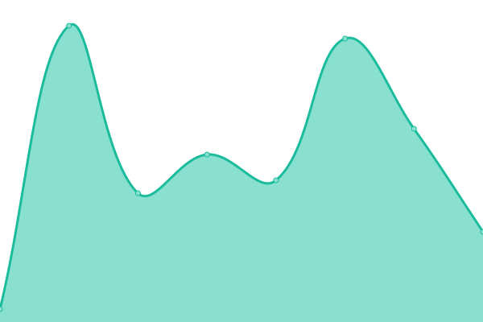 13ms
     
 | 

<a href="https://Skiddle-ID.github.io/status/history/asteria-3">100.00%</a>
    

|  [Asteria-4](https://api.skiddle.cloud/cloud/asteria-4/health) | 🟩 Up | [asteria-4.yml](https://github.com/Skiddle-ID/status/commits/HEAD/history/asteria-4.yml) | 

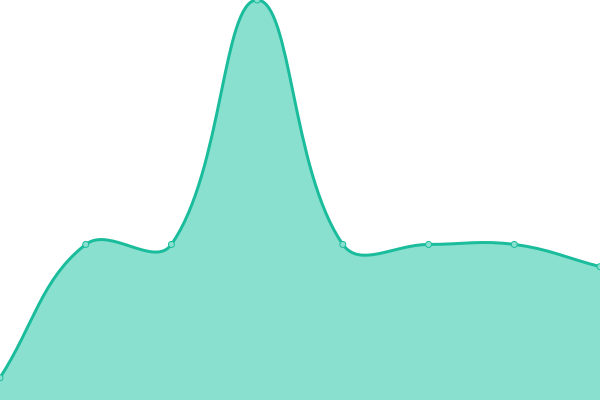 13ms
     
 | 

<a href="https://Skiddle-ID.github.io/status/history/asteria-4">100.00%</a>
    

|  [Asteria-5](https://api.skiddle.cloud/cloud/asteria-5/health) | 🟩 Up | [asteria-5.yml](https://github.com/Skiddle-ID/status/commits/HEAD/history/asteria-5.yml) | 

 13ms
     
 | 

<a href="https://Skiddle-ID.github.io/status/history/asteria-5">100.00%</a>
    

|  [Asteria-6](https://api.skiddle.cloud/cloud/asteria-6/health) | 🟩 Up | [asteria-6.yml](https://github.com/Skiddle-ID/status/commits/HEAD/history/asteria-6.yml) | 

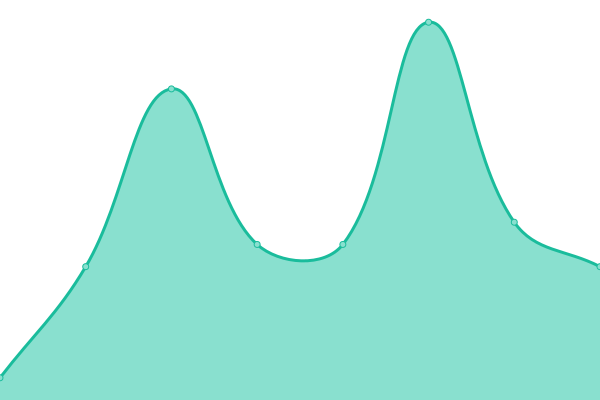 13ms
     
 | 

<a href="https://Skiddle-ID.github.io/status/history/asteria-6">100.00%</a>
    

|  [Arcturus-1 (Arcturus Cluster Controller)](https://api.skiddle.cloud/cloud/arcturus-1/health) | 🟩 Up | [arcturus-1-arcturus-cluster-controller.yml](https://github.com/Skiddle-ID/status/commits/HEAD/history/arcturus-1-arcturus-cluster-controller.yml) | 

 13ms
     
 | 

<a href="https://Skiddle-ID.github.io/status/history/arcturus-1-arcturus-cluster-controller">100.00%</a>
    

|  [Arcturus-2](https://api.skiddle.cloud/cloud/arcturus-2/health) | 🟩 Up | [arcturus-2.yml](https://github.com/Skiddle-ID/status/commits/HEAD/history/arcturus-2.yml) | 

 13ms
     
 | 

<a href="https://Skiddle-ID.github.io/status/history/arcturus-2">100.00%</a>
    

|  [Arcturus-3](https://api.skiddle.cloud/cloud/arcturus-3/health) | 🟩 Up | [arcturus-3.yml](https://github.com/Skiddle-ID/status/commits/HEAD/history/arcturus-3.yml) | 

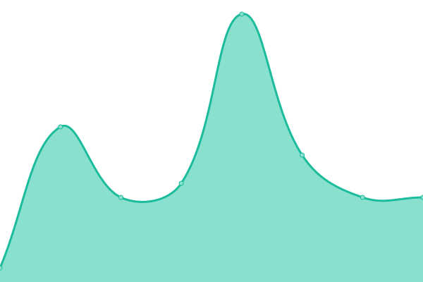 14ms
     
 | 

<a href="https://Skiddle-ID.github.io/status/history/arcturus-3">100.00%</a>
    

|  [Arcturus-4](https://api.skiddle.cloud/cloud/arcturus-4/health) | 🟩 Up | [arcturus-4.yml](https://github.com/Skiddle-ID/status/commits/HEAD/history/arcturus-4.yml) | 

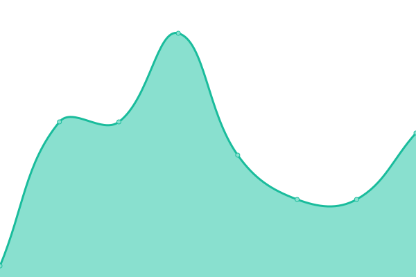 13ms
     
 | 

<a href="https://Skiddle-ID.github.io/status/history/arcturus-4">100.00%</a>
    

|  [Arcturus-5](https://api.skiddle.cloud/cloud/arcturus-5/health) | 🟩 Up | [arcturus-5.yml](https://github.com/Skiddle-ID/status/commits/HEAD/history/arcturus-5.yml) | 

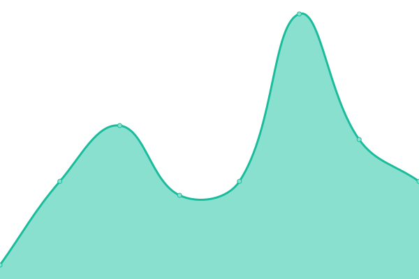 14ms
     
 | 

<a href="https://Skiddle-ID.github.io/status/history/arcturus-5">100.00%</a>
    

|  [Aquila-1 (Aquila Cluster Controller)](https://api.skiddle.cloud/cloud/aquila-1/health) | 🟩 Up | [aquila-1-aquila-cluster-controller.yml](https://github.com/Skiddle-ID/status/commits/HEAD/history/aquila-1-aquila-cluster-controller.yml) | 

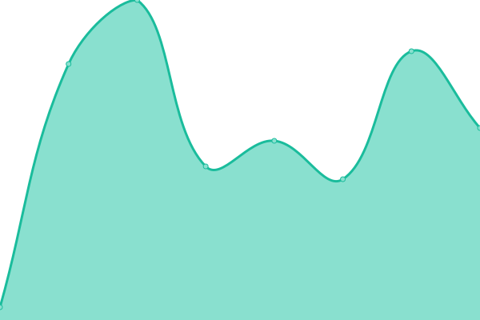 14ms
     
 | 

<a href="https://Skiddle-ID.github.io/status/history/aquila-1-aquila-cluster-controller">100.00%</a>
    

|  [Aquila-2](https://api.skiddle.cloud/cloud/aquila-2/health) | 🟩 Up | [aquila-2.yml](https://github.com/Skiddle-ID/status/commits/HEAD/history/aquila-2.yml) | 

 14ms
     
 | 

<a href="https://Skiddle-ID.github.io/status/history/aquila-2">100.00%</a>
    

|  [Aquila-3](https://api.skiddle.cloud/cloud/aquila-3/health) | 🟩 Up | [aquila-3.yml](https://github.com/Skiddle-ID/status/commits/HEAD/history/aquila-3.yml) | 

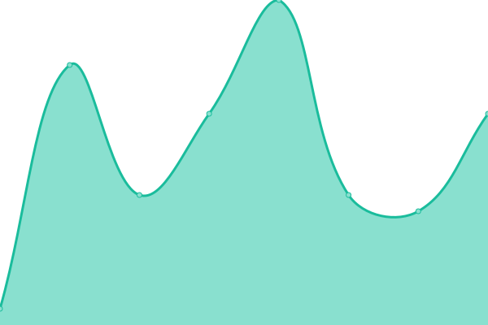 14ms
     
 | 

<a href="https://Skiddle-ID.github.io/status/history/aquila-3">100.00%</a>
    

|  [Aquila-4](https://api.skiddle.cloud/cloud/aquila-4/health) | 🟩 Up | [aquila-4.yml](https://github.com/Skiddle-ID/status/commits/HEAD/history/aquila-4.yml) | 

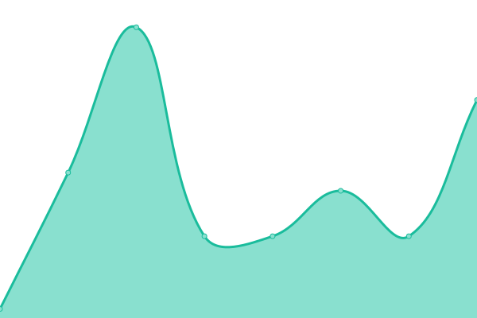 13ms
     
 | 

<a href="https://Skiddle-ID.github.io/status/history/aquila-4">100.00%</a>
    

|  [Aquila-5](https://api.skiddle.cloud/cloud/aquila-5/health) | 🟩 Up | [aquila-5.yml](https://github.com/Skiddle-ID/status/commits/HEAD/history/aquila-5.yml) | 

 14ms
     
 | 

<a href="https://Skiddle-ID.github.io/status/history/aquila-5">100.00%</a>
    

|  [Aquila-6](https://api.skiddle.cloud/cloud/aquila-6/health) | 🟩 Up | [aquila-6.yml](https://github.com/Skiddle-ID/status/commits/HEAD/history/aquila-6.yml) | 

 16ms
     
 | 

<a href="https://Skiddle-ID.github.io/status/history/aquila-6">100.00%</a>
    

|  [Aquila-7](https://api.skiddle.cloud/cloud/aquila-7/health) | 🟩 Up | [aquila-7.yml](https://github.com/Skiddle-ID/status/commits/HEAD/history/aquila-7.yml) | 

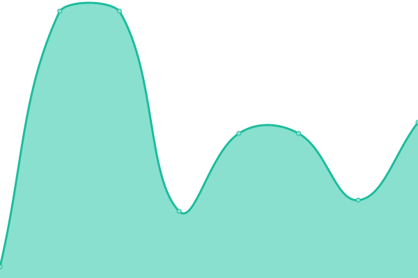 16ms
     
 | 

<a href="https://Skiddle-ID.github.io/status/history/aquila-7">100.00%</a>
    

|  [Galileo-1 (PostgreSQL Server - Main)](https://api.skiddle.cloud/cloud/galileo-1/health) | 🟩 Up | [galileo-1-postgre-sql-server-main.yml](https://github.com/Skiddle-ID/status/commits/HEAD/history/galileo-1-postgre-sql-server-main.yml) | 

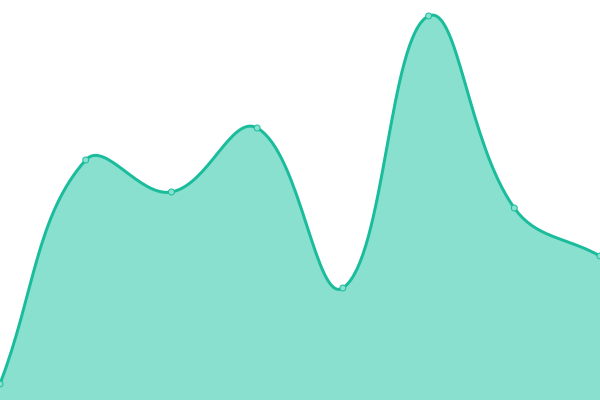 14ms
     
 | 

<a href="https://Skiddle-ID.github.io/status/history/galileo-1-postgre-sql-server-main">100.00%</a>
    

|  [Galileo-2 (PostgreSQL Server - Mirror)](https://api.skiddle.cloud/cloud/galileo-2/health) | 🟩 Up | [galileo-2-postgre-sql-server-mirror.yml](https://github.com/Skiddle-ID/status/commits/HEAD/history/galileo-2-postgre-sql-server-mirror.yml) | 

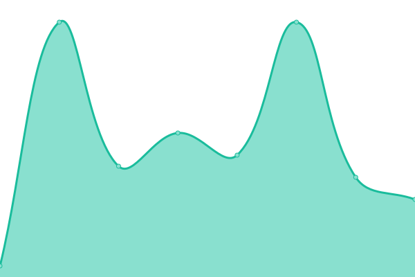 13ms
     
 | 

<a href="https://Skiddle-ID.github.io/status/history/galileo-2-postgre-sql-server-mirror">100.00%</a>
    

|  [Galileo-3 (MySQL Server - Main)](https://api.skiddle.cloud/cloud/galileo-3/health) | 🟩 Up | [galileo-3-my-sql-server-main.yml](https://github.com/Skiddle-ID/status/commits/HEAD/history/galileo-3-my-sql-server-main.yml) | 

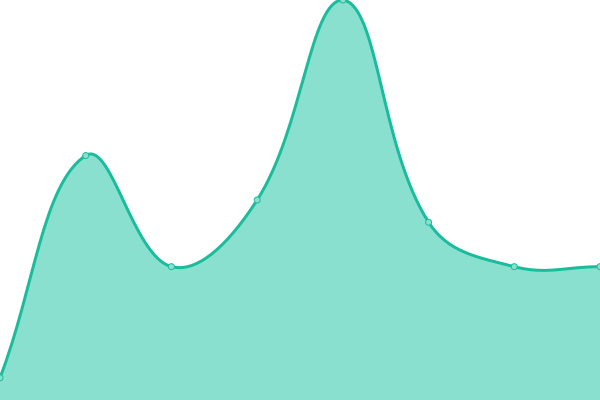 14ms
     
 | 

<a href="https://Skiddle-ID.github.io/status/history/galileo-3-my-sql-server-main">100.00%</a>
    

|  [Galileo-4 (MySQL Server - Mirror)](https://api.skiddle.cloud/cloud/galileo-4/health) | 🟩 Up | [galileo-4-my-sql-server-mirror.yml](https://github.com/Skiddle-ID/status/commits/HEAD/history/galileo-4-my-sql-server-mirror.yml) | 

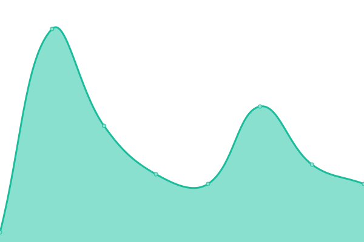 15ms
     
 | 

<a href="https://Skiddle-ID.github.io/status/history/galileo-4-my-sql-server-mirror">100.00%</a>
    

|  [Kepler-1 (Nextcloud)](https://api.skiddle.cloud/cloud/kepler-1/health) | 🟩 Up | [kepler-1-nextcloud.yml](https://github.com/Skiddle-ID/status/commits/HEAD/history/kepler-1-nextcloud.yml) | 

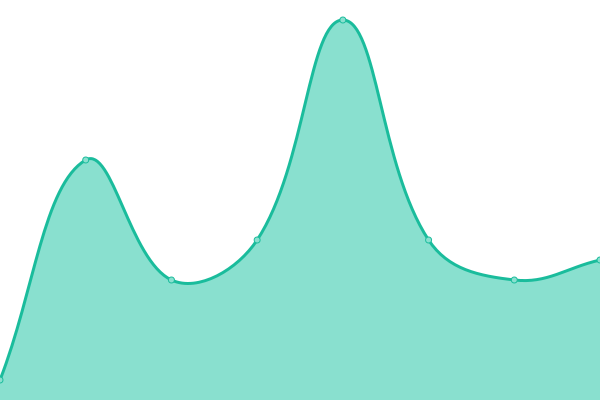 14ms
     
 | 

<a href="https://Skiddle-ID.github.io/status/history/kepler-1-nextcloud">100.00%</a>
    

|  [Kepler-2 (Nextcloud)](https://api.skiddle.cloud/cloud/kepler-2/health) | 🟩 Up | [kepler-2-nextcloud.yml](https://github.com/Skiddle-ID/status/commits/HEAD/history/kepler-2-nextcloud.yml) | 

 14ms
     
 | 

<a href="https://Skiddle-ID.github.io/status/history/kepler-2-nextcloud">100.00%</a>
    

|  [Kepler-3 (Minio)](https://api.skiddle.cloud/cloud/kepler-3/health) | 🟩 Up | [kepler-3-minio.yml](https://github.com/Skiddle-ID/status/commits/HEAD/history/kepler-3-minio.yml) | 

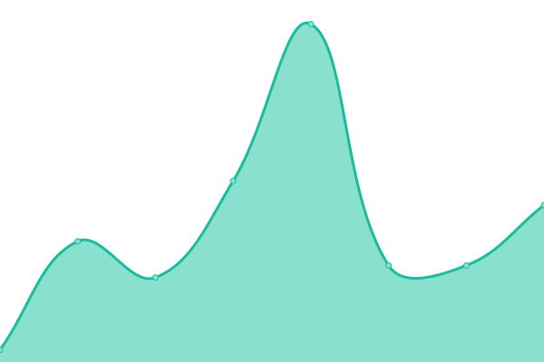 13ms
     
 | 

<a href="https://Skiddle-ID.github.io/status/history/kepler-3-minio">100.00%</a>
    

|  [Kepler-4 (Minio)](https://api.skiddle.cloud/cloud/kepler-4/health) | 🟩 Up | [kepler-4-minio.yml](https://github.com/Skiddle-ID/status/commits/HEAD/history/kepler-4-minio.yml) | 

 14ms
     
 | 

<a href="https://Skiddle-ID.github.io/status/history/kepler-4-minio">100.00%</a>
    

|  [Kepler-5 (Minio)](https://api.skiddle.cloud/cloud/kepler-5/health) | 🟩 Up | [kepler-5-minio.yml](https://github.com/Skiddle-ID/status/commits/HEAD/history/kepler-5-minio.yml) | 

 14ms
     
 | 

<a href="https://Skiddle-ID.github.io/status/history/kepler-5-minio">100.00%</a>
    

|  [Kepler-6 (Minio)](https://api.skiddle.cloud/cloud/kepler-6/health) | 🟩 Up | [kepler-6-minio.yml](https://github.com/Skiddle-ID/status/commits/HEAD/history/kepler-6-minio.yml) | 

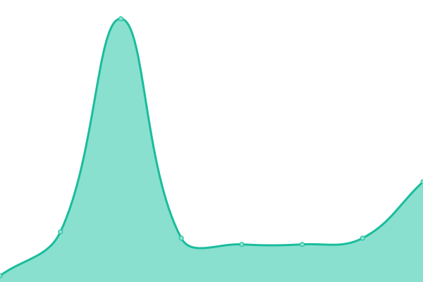 14ms
     
 | 

<a href="https://Skiddle-ID.github.io/status/history/kepler-6-minio">100.00%</a>
    

|  [Kepler-7 (Minio)](https://api.skiddle.cloud/cloud/kepler-7/health) | 🟩 Up | [kepler-7-minio.yml](https://github.com/Skiddle-ID/status/commits/HEAD/history/kepler-7-minio.yml) | 

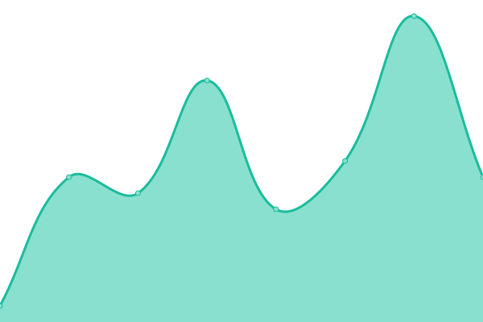 14ms
     
 | 

<a href="https://Skiddle-ID.github.io/status/history/kepler-7-minio">100.00%</a>
    

|  [Kepler-8 (Minio)](https://api.skiddle.cloud/cloud/kepler-8/health) | 🟩 Up | [kepler-8-minio.yml](https://github.com/Skiddle-ID/status/commits/HEAD/history/kepler-8-minio.yml) | 

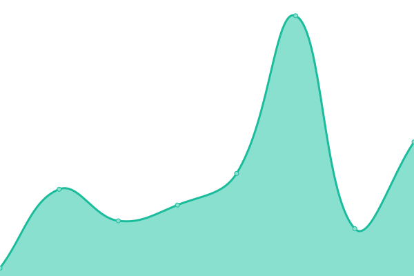 13ms
     
 | 

<a href="https://Skiddle-ID.github.io/status/history/kepler-8-minio">100.00%</a>
    

|  [Kepler-9 (Minio)](https://api.skiddle.cloud/cloud/kepler-9/health) | 🟩 Up | [kepler-9-minio.yml](https://github.com/Skiddle-ID/status/commits/HEAD/history/kepler-9-minio.yml) | 

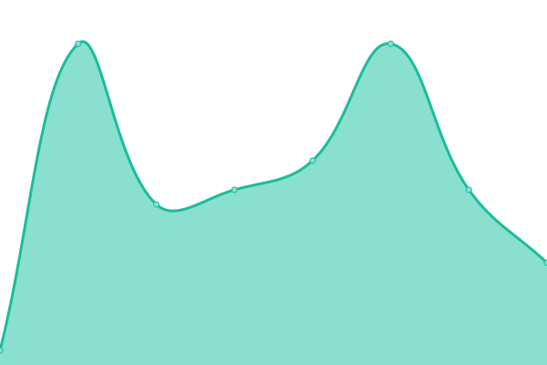 13ms
     
 | 

<a href="https://Skiddle-ID.github.io/status/history/kepler-9-minio">100.00%</a>
    

|  [Kepler-10 (Minio)](https://api.skiddle.cloud/cloud/kepler-10/health) | 🟩 Up | [kepler-10-minio.yml](https://github.com/Skiddle-ID/status/commits/HEAD/history/kepler-10-minio.yml) | 

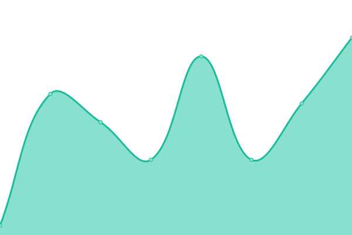 15ms
     
 | 

<a href="https://Skiddle-ID.github.io/status/history/kepler-10-minio">100.00%</a>
    

|  [Nebula-1](https://api.skiddle.cloud/cloud/nebula-1/health) | 🟩 Up | [nebula-1.yml](https://github.com/Skiddle-ID/status/commits/HEAD/history/nebula-1.yml) | 

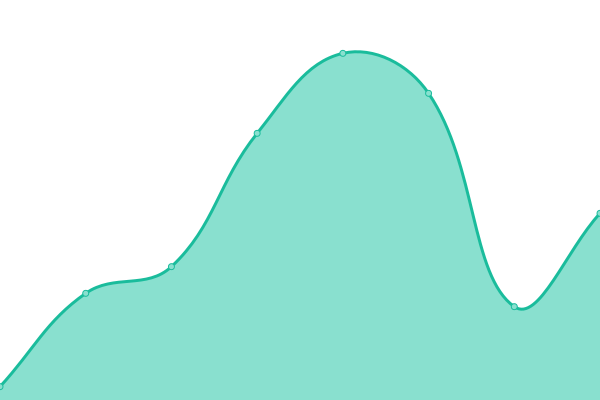 14ms
     
 | 

<a href="https://Skiddle-ID.github.io/status/history/nebula-1">100.00%</a>
    

|  [Nebula-2](https://api.skiddle.cloud/cloud/nebula-2/health) | 🟩 Up | [nebula-2.yml](https://github.com/Skiddle-ID/status/commits/HEAD/history/nebula-2.yml) | 

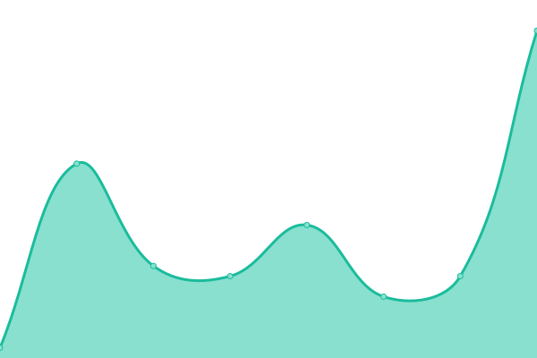 13ms
     
 | 

<a href="https://Skiddle-ID.github.io/status/history/nebula-2">100.00%</a>
    

|  [Prometheus-1](https://api.skiddle.cloud/cloud/prometheus-1/health) | 🟩 Up | [prometheus-1.yml](https://github.com/Skiddle-ID/status/commits/HEAD/history/prometheus-1.yml) | 

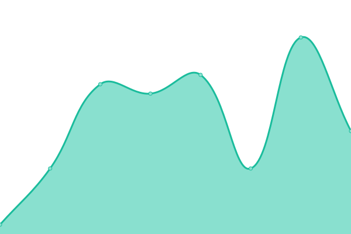 13ms
     
 | 

<a href="https://Skiddle-ID.github.io/status/history/prometheus-1">100.00%</a>
    

|  [Prometheus-2](https://api.skiddle.cloud/cloud/prometheus-2/health) | 🟩 Up | [prometheus-2.yml](https://github.com/Skiddle-ID/status/commits/HEAD/history/prometheus-2.yml) | 

 15ms
     
 | 

<a href="https://Skiddle-ID.github.io/status/history/prometheus-2">100.00%</a>
    

|  [Athalie-1](https://api.skiddle.cloud/cloud/athalie-1/health) | 🟩 Up | [athalie-1.yml](https://github.com/Skiddle-ID/status/commits/HEAD/history/athalie-1.yml) | 

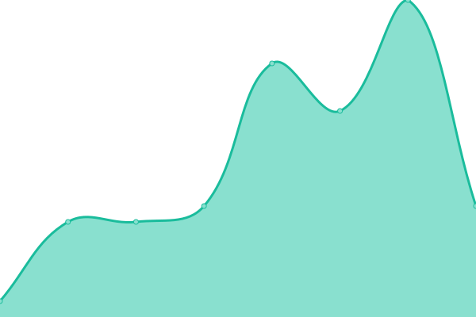 13ms
     
 | 

<a href="https://Skiddle-ID.github.io/status/history/athalie-1">100.00%</a>
    

|  [Athalie-2](https://api.skiddle.cloud/cloud/athalie-2/health) | 🟩 Up | [athalie-2.yml](https://github.com/Skiddle-ID/status/commits/HEAD/history/athalie-2.yml) | 

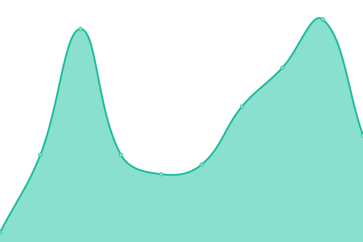 14ms
     
 | 

<a href="https://Skiddle-ID.github.io/status/history/athalie-2">100.00%</a>
    

|  [Athalie-3](https://api.skiddle.cloud/cloud/athalie-3/health) | 🟩 Up | [athalie-3.yml](https://github.com/Skiddle-ID/status/commits/HEAD/history/athalie-3.yml) | 

 14ms
     
 | 

<a href="https://Skiddle-ID.github.io/status/history/athalie-3">100.00%</a>
    

|  [Athalie-4](https://api.skiddle.cloud/cloud/athalie-4/health) | 🟩 Up | [athalie-4.yml](https://github.com/Skiddle-ID/status/commits/HEAD/history/athalie-4.yml) | 

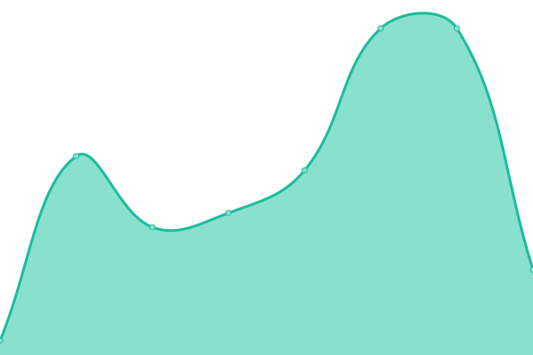 12ms
     
 | 

<a href="https://Skiddle-ID.github.io/status/history/athalie-4">100.00%</a>
    

|  [CDN via Cloudflare](https://api.skiddle.cloud/cdn/cloudflare/health) | 🟩 Up | [cdn-via-cloudflare.yml](https://github.com/Skiddle-ID/status/commits/HEAD/history/cdn-via-cloudflare.yml) | 

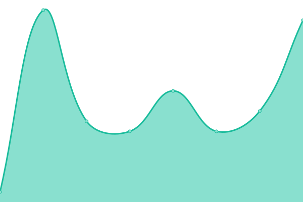 14ms
     
 | 

<a href="https://Skiddle-ID.github.io/status/history/cdn-via-cloudflare">100.00%</a>
    

|  [CDN via Backblaze](https://api.skiddle.cloud/cdn/backblaze/health) | 🟩 Up | [cdn-via-backblaze.yml](https://github.com/Skiddle-ID/status/commits/HEAD/history/cdn-via-backblaze.yml) | 

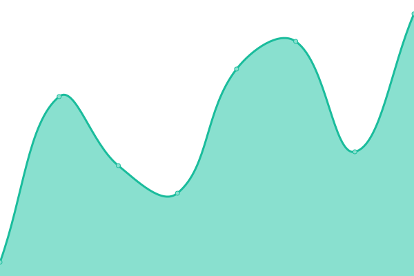 13ms
     
 | 

<a href="https://Skiddle-ID.github.io/status/history/cdn-via-backblaze">100.00%</a>
    

|  [AS13335 (Cloudflare)](https://api.skiddle.cloud/network/AS13335/health) | 🟩 Up | [as-13335-cloudflare.yml](https://github.com/Skiddle-ID/status/commits/HEAD/history/as-13335-cloudflare.yml) | 

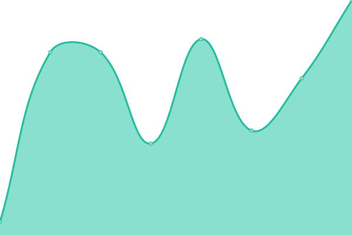 13ms
     
 | 

<a href="https://Skiddle-ID.github.io/status/history/as-13335-cloudflare">100.00%</a>
    

|  [AS1299 (Arelion)](https://api.skiddle.cloud/network/AS1299/health) | 🟩 Up | [as-1299-arelion.yml](https://github.com/Skiddle-ID/status/commits/HEAD/history/as-1299-arelion.yml) | 

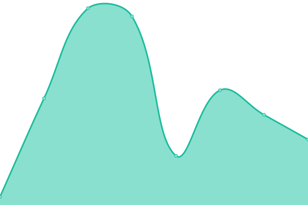 14ms
     
 | 

<a href="https://Skiddle-ID.github.io/status/history/as-1299-arelion">100.00%</a>
    

|  [AS47311 (Atharva)](https://api.skiddle.cloud/network/AS47311/health) | 🟩 Up | [as-47311-atharva.yml](https://github.com/Skiddle-ID/status/commits/HEAD/history/as-47311-atharva.yml) | 

 13ms
     
 | 

<a href="https://Skiddle-ID.github.io/status/history/as-47311-atharva">100.00%</a>
    

<!--end: status pages-->

[**Visit our status website →**](https://Skiddle-ID.github.io/status)

## 📄 License

- Powered by: [Upptime](https://github.com/upptime/upptime)
- Code: [MIT](./LICENSE) © [Anand Chowdhary](https://anandchowdhary.com), supported by [Pabio](https://pabio.com)
- Data in the `./history` directory: [Open Database License](https://opendatacommons.org/licenses/odbl/1-0/)
